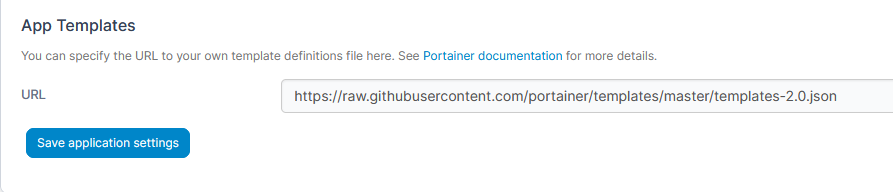
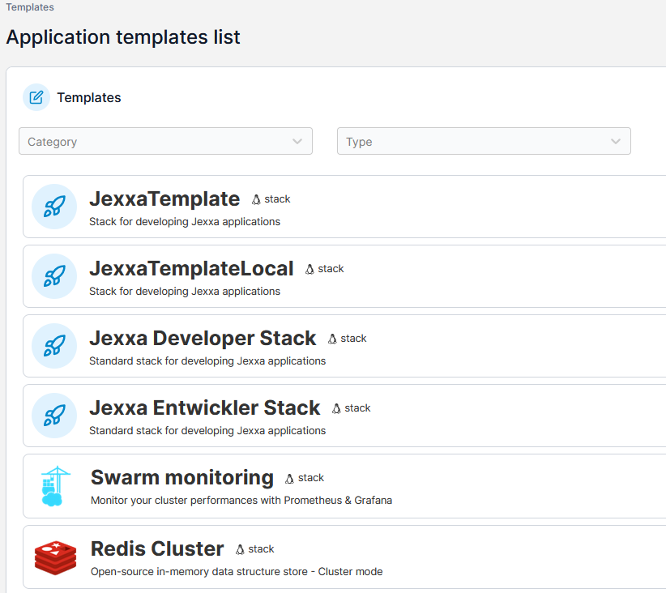
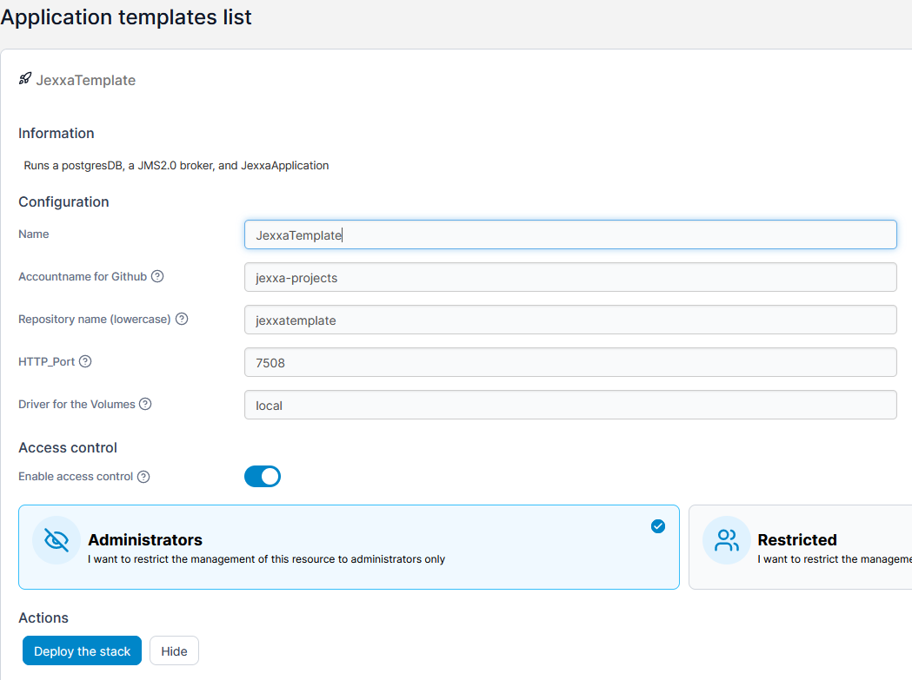
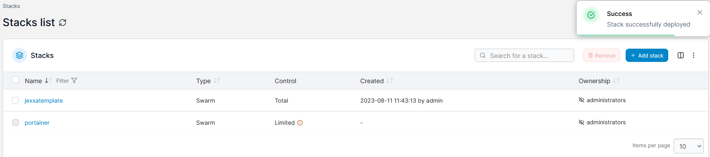
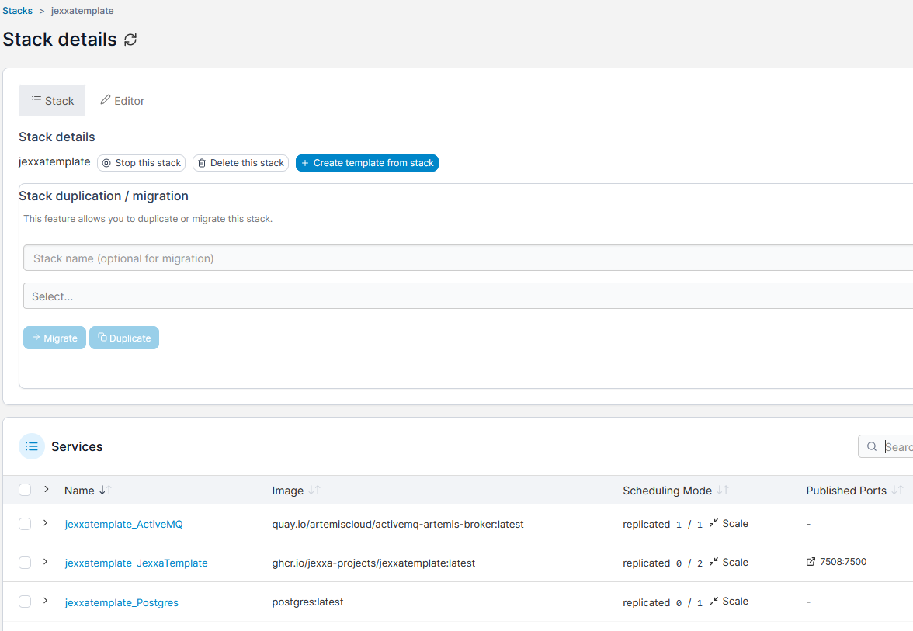

# App Templates

This repository hosts templates (**'Apps Templates'**) definitions for Portainer.

For more information about the template definition format and how to deploy your own templates, see the [relevant documentation section](https://documentation.portainer.io/v2.0/templates/deploy_stack/).

## Setting up:

1. Open your a Portainer instance in your browser

2. Go to Settings and exchange the URL under App templates with: https://raw.githubusercontent.com/SvenGoergen/portainer-templates/master/templates-2.0.json

  

Default: https://raw.githubusercontent.com/portainer/templates/master/templates-2.0.json

#

3. In Portainer klick on App Templates. You should now see all the different templates

    

## Using App Templates and deploying

1. Select the template you want to deploy

3. In the configuration, name your stack and change the default-values as you see fit

  

#

5. Klick on Deploy the Stack

6. If everything worked, Portainer will tell you that your stack was successfully deployed

   

## Viewing your stack

1. Klick on stacks

   

   #

3. choose your new stack: here you can view and inspect your template-created stack

   
